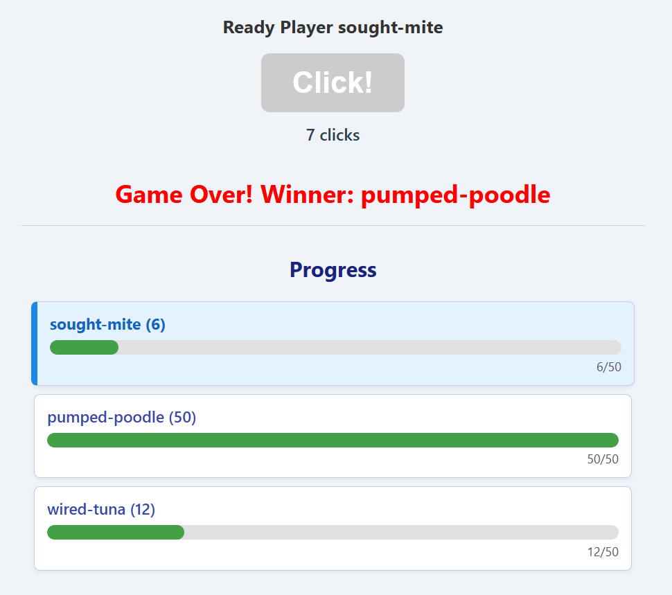

Play a dumb game where you and your friends see who can click the fastest.
First player to get to 50 clicks wins.

Running main.py will create a webserver on the host computer. 
Users can enter the URL for this webserver in their browser.

They'll be assigned a user name and they'll be able to see other users who have recently visited.
There is no mechanism to sync the start time, so it works best if one user does a countdown to start everyone.

Any given user's webpage will show their progress versus everyone else.
When one user hits 50 clicks, the game ends for everyone and the server must be restarted.

This was created as a pedagogical example of using python as a webserver and handling events from html / javascript.
